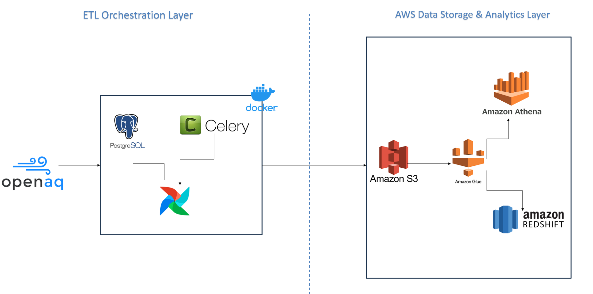
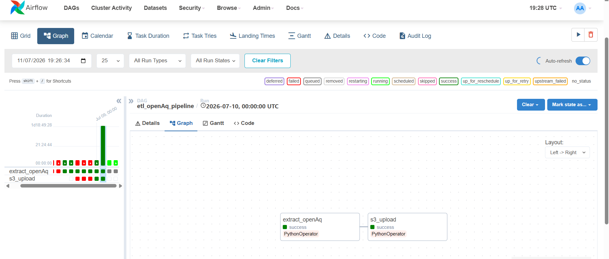

# OpenAQ Data Engineering ETL on AWS

A Data Engineering ETL project that extracts air quality data from the OpenAQ API, orchestrates ETL workflows using Apache Airflow, transforms and stores datasets in Amazon S3, catalogs metadata with AWS Glue, enables serverless SQL analytics through Amazon Athena, and loads curated datasets into Amazon Redshift for high-performance analytics.

## Project Overview

Air quality monitoring is essential for environmental analysis and public health. OpenAQ provides open environmental measurements collected from thousands of monitoring stations worldwide.

The objective of this project is to build a complete ETL solution capable of:

- Extracting air quality measurements from the OpenAQ REST API
- Transforming and cleaning the collected data
- Storing raw datasets inside Amazon S3
- Building a metadata catalog using AWS Glue
- Querying the data using Amazon Athena
- Loading curated datasets into Amazon Redshift for analytical workloads

The project demonstrates an ETL architecture using Apache Airflow and AWS services.

## Architecture



## Technologies

- Python
- Apache Airflow
- Celery Executor
- Docker
- PostgreSQL
- Amazon S3
- AWS Glue
- AWS Glue Crawlers
- AWS Glue Data Catalog
- Amazon Athena
- Amazon Redshift Serverless
- Pandas
- PySpark
- GitHub Actions

## Data Source

This project uses the **OpenAQ REST API**.

OpenAQ is a global open-data platform providing air quality measurements collected from governmental and scientific monitoring stations around the world.

The extracted data includes:

- Monitoring station
- Sensor information
- Pollutant
- Measurement value
- Unit
- Timestamp
- Country
- Coordinates

## ETL Workflow

The ETL process is orchestrated using Apache Airflow.

### 1. Data Extraction

Retrieve air quality measurements from the OpenAQ REST API.

### 2. Data Transformation

Extract the required fields, enrich the records with location and sensor information, and convert them into a structured dataset.

### 3. Data Loading

Store the transformed dataset as a CSV file in Amazon S3 for further processing and analytics.

Once the data is stored in S3:

- AWS Glue Crawlers automatically discover the schema.
- AWS Glue Data Catalog stores table metadata.
- Amazon Athena enables serverless SQL queries.
- AWS Glue ETL prepares analytical datasets.
- Curated datasets are loaded into Amazon Redshift Serverless.
## How to Run

### Prerequisites

- Docker & Docker Compose installed
- Python 3.9+
- AWS credentials configured (Access Key / Secret Key with S3, Glue, Athena, and Redshift permissions)

### 1. Clone the repository

```bash
git clone https://github.com/AmalDhouib/OpenAQ-Data-Engineering-ETL-with-Apache-Airflow-and-AWS.git
cd OpenAQ-Data-Engineering-ETL-with-Apache-Airflow-and-AWS
```
### 2. Create the project folders

**Windows (PowerShell):**

```powershell
New-Item -ItemType Directory -Path config,dags,data,logs,pipelines,tests,utils
```

**Linux / macOS:**

```bash
mkdir -p config dags data logs pipelines tests utils
```

### 3. Configure environment variables

Create a `.env` file at the root of the project with your AWS and Airflow configuration:

```env
AWS_ACCESS_KEY_ID=your_access_key
AWS_SECRET_ACCESS_KEY=your_secret_key
AWS_REGION=your_region
S3_BUCKET_NAME=your_bucket_name
```

### 4. Install Python dependencies (local development)

```bash
python -m venv venv
source venv/bin/activate   # On Windows: venv\Scripts\activate
pip install -r requirements.txt
```

### 5. Build and start the Airflow environment with Docker Compose

```bash
docker-compose build
docker-compose up airflow-init
docker-compose up -d
```

### 6. Access the Airflow UI

Open your browser at:

```
http://localhost:8080
```

Default credentials (unless changed):

```
username: airflow
password: airflow
```

### 7. Trigger the DAG

From the Airflow UI, enable and trigger the `OpenAQ_ETL` DAG.

Or via CLI:

```bash
docker-compose exec airflow-webserver airflow dags trigger OpenAQ_ETL
```

### 8. Stop the environment

```bash
docker-compose down
```

To also remove volumes (database, logs, etc.):

```bash
docker-compose down -v
```

## Project Structure

```
project/
│
├── .github/
│   └── workflows/
│       └── ci.yml
│
├── dags/
├── data/
├── config/
├── logs/
├── pipelines/
├── utils/
├── airflow.env
├── docker-compose.yml
├── Dockerfile
├── requirements.txt
└── README.md
```

## Airflow DAG

The ETL workflow is orchestrated by Apache Airflow and runs daily.

```text
etl_openAq_pipeline
        │
        ▼
extract_openAq
      +
s3_upload
```
## CI Pipeline

The project uses **GitHub Actions** to automatically validate the code and Docker environment on pushes and pull requests to the `main` branch.

The CI workflow consists of two jobs:

1. **Code Validation**
   - Checks out the repository
   - Sets up Python 3.9
   - Validates Python syntax in the `dags`, `pipelines`, and `utils` directories

2. **Docker Build**
   - Runs only if code validation succeeds
   - Builds the Airflow Docker image
   - Verifies that the Docker environment and Python dependencies can be successfully built

```text
Push / Pull Request
        │
        ▼
 Code Validation
        │
        ▼
   Docker Build
        │
        ▼
   CI Successful
```
## AWS Data Lake

The project leverages several AWS services:

### Amazon S3

Stores raw and transformed datasets.

### AWS Glue

Discovers datasets, manages metadata, and executes distributed ETL jobs using PySpark.

### AWS Glue Crawlers

Automatically infer schemas from files stored in S3.

### AWS Glue Data Catalog

Central metadata repository used by Glue and Athena.

### Amazon Athena

Provides serverless SQL querying over data stored in S3.

### Amazon Redshift Serverless

Stores curated datasets optimized for analytical workloads.

## AWS Services Used

| Service | Purpose |
|---|---|
| S3 | Data Lake |
| Glue | ETL |
| Glue Crawlers | Schema Discovery |
| Glue Data Catalog | Metadata |
| Athena | SQL Queries |
| Redshift | Data Warehouse |
| IAM | Security |


## Future Improvements

- Data Quality validation
- CloudWatch monitoring
- PowerBI dashboards


### Airflow DAG



---

